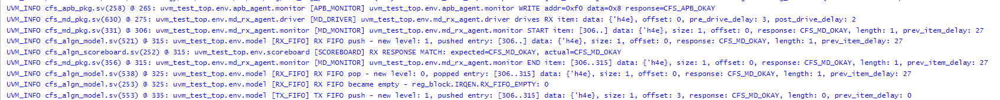
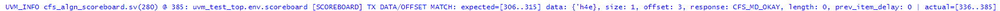
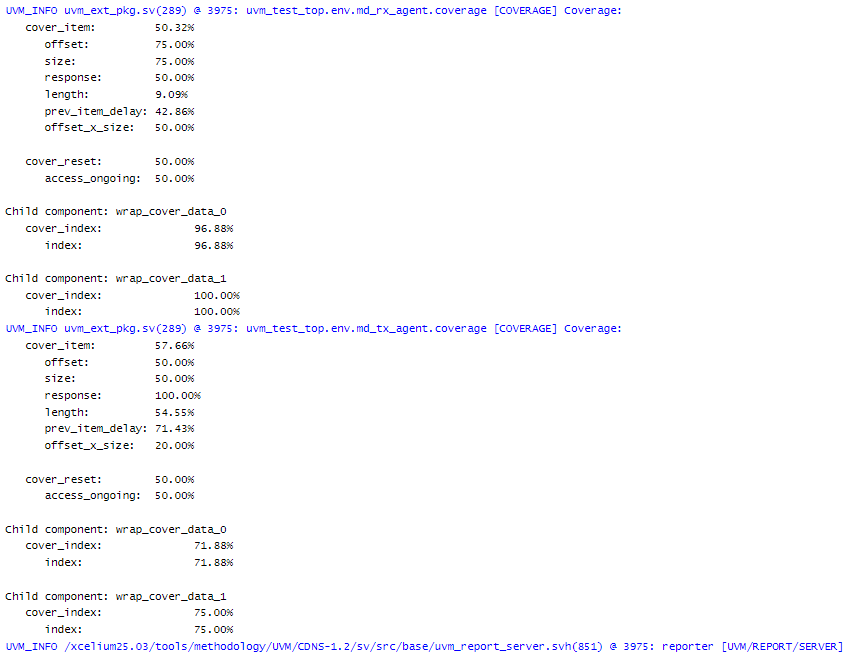

# UVM Aligner Verification Environment

SystemVerilog/UVM verification environment for an **Aligner DUT**.

> **Scope note:** this repository contains the verification environment only.  
> The DUT RTL was provided as third-party course material and is not redistributed here.

---

## What This Project Demonstrates

- UVM environment architecture
- APB register access verification
- MD RX/TX transaction-level verification
- Virtual sequencer and virtual sequences
- UVM Register Abstraction Layer (RAL)
- Register prediction and status checking
- Reference model and scoreboard comparison
- Functional coverage collection
- Reset-aware verification behavior
- Error/drop scenarios, including illegal and unmapped access behavior

---

## Repository Structure

```text
algn/
  Aligner-specific environment, model, scoreboard, coverage,
  register predictor, virtual sequencer, and virtual sequences.

algn/reg/
  Aligner UVM register model:
  CTRL, STATUS, IRQEN, IRQ, and the register block.

apb/
  APB verification agent:
  item classes, driver, monitor, coverage, sequences, agent config,
  package, and register adapter.

md/
  MD protocol verification agent:
  master/slave items, drivers, monitors, coverage, sequencers,
  sequences, agent configs, and package.

uvm_ext/
  Reusable UVM infrastructure used by the APB and MD agents:
  base agent, driver, monitor, sequencer, coverage, reset handler,
  and coverage helper wrappers.

tests/
  UVM tests and test package.

tb/
  Testbench top and simulation file list.
```

---

## High-Level Verification Flow
```text
Test
  |
  v
Virtual Sequence
  |
  v
Virtual Sequencer
  |------------------------------|
  |                              |
  v                              v
APB / Register Sequence      MD RX Sequence
  |                              |
  v                              v
APB Agent                    MD RX Agent
  |                              |
  v                              |---- observed RX items ----|
Register Model / DUT Regs        |                         |
  |                              v                         v
  |                         DUT RX Input            Reference Model
  |                              |              RX FIFO / Model / TX FIFO
  |                              v                         |
  +-----------------------> Aligner DUT                    |
       config/status             |                         |
                                 v                         v
                           DUT TX Output          Expected TX items
                                 |                         |
                                 v                         |
                            MD TX Monitor                 |
                                 |                         |
                                 v                         v
                              Scoreboard <-----------------
                         actual TX vs expected TX

Coverage samples:
- APB monitor transactions
- MD RX monitor transactions
- MD TX monitor transactions
- reset/drop/status-related behavior
```

For a detailed architectural diagram:
[View Full Architecture](docs/ARCHITECTURE.md)
---

## Main Verification Idea

The DUT receives data through the MD RX side.

The test configures alignment behavior through APB-accessed registers.  
The reference model predicts the expected TX-side behavior, and the scoreboard compares this expected stream against the actual TX monitor output.

The environment also checks status behavior such as dropped transactions, register/status updates, and error-oriented scenarios.

---

## Important Components

### APB Agent

The APB agent drives and monitors APB transactions used for register accesses.  
It also includes an adapter that connects bus-level APB transactions to the UVM register model.

### MD Agent

The MD agent supports both master and slave behavior.  
It is used for RX/TX transaction flow, including data, offset, size, response, and timing behavior.

### Register Model

The register model describes the Aligner register map and fields, including:

- `CTRL`
- `STATUS`
- `IRQEN`
- `IRQ`

### Reference Model

The model predicts the expected aligned output according to the configured register values and incoming RX data.

### Scoreboard

The scoreboard compares the expected model output against the actual TX monitor output.

### Coverage

Coverage is collected at several levels:

- APB protocol and access behavior
- MD protocol/data behavior
- Aligner-specific functional behavior

---

## Running

This repository does not include the RTL/DUT files.  
To run the simulation, add the DUT RTL files to the simulation setup/file list.

Example with a UVM-compatible simulator:

```bash
xrun -uvm -sv -f tb/messages.f +UVM_TESTNAME=algn_test_random
```

The exact command may require adjustment based on your simulator and local RTL file locations.


## Example Verification Flow

This log demonstrates a full transaction path through the verification environment:
from APB configuration, through stimulus injection (RX),
internal processing (model + FIFO),
to DUT output validation (TX + Scoreboard).

### Flow Overview


### Scoreboard Comparison


### Functional Coverage


> Note: Coverage results shown here are based on a short simulation run (limited number of transactions),
> intended to keep the log readable and focused for demonstration purposes.
> Higher coverage can be achieved by extending the number of randomized transactions and scenarios.
>
> ### Full Simulation Log

The full simulation log for this demo run is available here:

[View Full Log](docs/logs/normal_flow_demo_log.txt)

This log demonstrates:
- APB register configuration
- MD RX/TX transaction flow
- Monitor tracking (RX and TX)
- Model FIFO behavior
- Scoreboard comparisons (expected vs actual)
- Functional coverage collection
- Clean UVM report (0 errors, 0 fatals)

> Note: Naming such as `aligner_*` is adapted for clarity and consistency in this repository.
