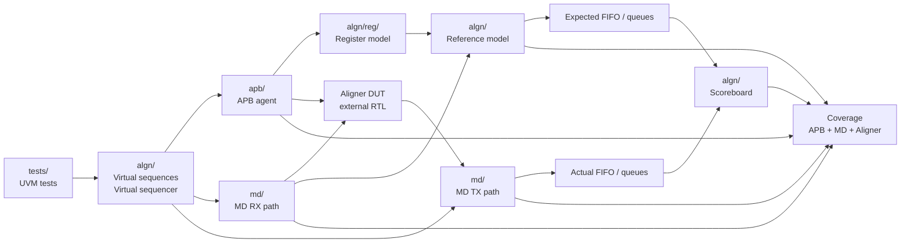
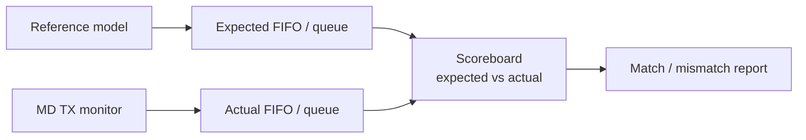

# UVM Aligner Verification Environment

SystemVerilog/UVM verification environment for an **APB-controlled Aligner DUT**.

> Scope note: this repository contains the verification environment only.  
> The DUT RTL was provided as third-party course material and is not redistributed here.

---

## What This Project Demonstrates

- UVM environment architecture
- APB register access verification
- MD RX/TX transaction-level verification
- Virtual sequencer and virtual sequences
- UVM Register Abstraction Layer (RAL)
- Reference model and scoreboard comparison
- FIFO/queue-based checking for non-1:1 input-output behavior
- Functional coverage
- Reset-aware verification
- Error/drop scenarios

---

## Project Idea

The DUT is an **Aligner**.

It receives MD RX traffic, is configured through APB registers, processes the data, and produces MD TX output.

Depending on register configuration and RX traffic, the DUT may:

- Pass data normally
- Align data according to configured size/offset
- Split one RX item into multiple TX items
- Drop illegal or unsupported traffic
- Update status / IRQ / drop-related information
- Clear internal state during reset

The key verification challenge is that the output is **not always one-to-one with the input**.

```text
1 RX input         → 1 TX output
1 RX input         → multiple TX outputs
multiple RX inputs → 1 TX output
illegal RX input   → no TX output
reset              → internal state is cleared
```

Because of that, the environment does not compare RX directly to TX.  
Instead, it uses a reference model and FIFO/queue-based scoreboard comparison.

---

## High-Level Architecture



---

## Verification Flow

```text
APB configures the DUT
→ MD RX sends input traffic
→ Aligner DUT aligns / splits / drops / passes data
→ MD TX monitor captures actual output
→ Reference model predicts expected behavior
→ Scoreboard compares expected vs actual using queues/FIFOs
→ Coverage tracks exercised scenarios
```

---

## Repository Structure

```text
algn/
  Aligner-specific environment, reference model, scoreboard,
  coverage, register predictor, virtual sequencer, and virtual sequences.

algn/reg/
  UVM register model: CTRL, STATUS, IRQEN, IRQ, and register block.

apb/
  APB verification agent: items, driver, monitor, coverage,
  sequences, agent configuration, package, and register adapter.

md/
  MD protocol verification agent: RX/TX items, drivers, monitors,
  coverage, sequencers, sequences, agent configurations, and package.

uvm_ext/
  Reusable UVM base infrastructure and coverage helpers.

tests/
  UVM tests and test package.

tb/
  Testbench top and simulation file list.

docs/
  Architecture notes, demo logs, and project documentation.
```

---

## Main Components

### APB Agent

APB is the configuration/control path.  
It is used to access registers such as `CTRL`, `STATUS`, `IRQEN`, and `IRQ`.

Example:

```text
Write CTRL.SIZE / CTRL.OFFSET
→ Send MD RX data
→ DUT behavior changes according to the configured values
```

### MD Agent

The MD RX side injects input traffic into the DUT.  
The MD TX monitor observes what the DUT actually produced.

MD transactions may include data, offset, size, response, delay, and legal/illegal behavior.

### Register Model

The register model tracks the DUT register configuration and connects APB register accesses to higher-level checking.

### Reference Model

The reference model predicts what the DUT should do using:

- Observed RX traffic
- Current register configuration
- Alignment behavior
- Split behavior
- Drop/error expectations
- Expected RX response
- Expected TX items
- Expected IRQ/status behavior
- Reset handling

### Scoreboard

The scoreboard compares expected behavior from the reference model against actual behavior from the monitors.



This supports delayed output, split output, dropped traffic, reset cleanup, and non-1:1 input-output behavior.

### Coverage

Coverage measures which scenarios were exercised.

```text
Scoreboard: Was the behavior correct?
Coverage:   Which scenarios were actually tested?
```

Coverage includes APB behavior, MD behavior, Aligner split/drop behavior, reset, status, and IRQ-related scenarios.

---

## Reset and Error Handling

Reset is treated as part of the verification space.  
The environment clears or synchronizes model state, FIFOs/queues, and active checking processes to avoid stale comparisons.

Illegal or unsupported traffic is intentionally generated as negative testing:

```text
Illegal RX item
→ Model predicts error/drop behavior
→ Invalid data must not leak to TX
→ CNT_DROP/status behavior is checked
→ Scoreboard compares expected vs actual
→ Coverage samples the scenario
```

---

## Running

This repository does not include the RTL/DUT files.  
To run the simulation, add the DUT RTL files to the simulation setup/file list.

Example:

```bash
xrun -uvm -sv -f tb/messages.f +UVM_TESTNAME=algn_test_random
```

The exact command may require adjustment based on your simulator and local RTL file locations.

---

## One-Sentence Summary

This project is a SystemVerilog/UVM verification environment for an APB-controlled Aligner DUT, where virtual sequences coordinate APB configuration and MD RX/TX traffic, a reference model predicts alignment/split/drop/status behavior, a FIFO-based scoreboard compares expected and actual streams without assuming 1:1 input-output mapping, and coverage measures which scenarios were exercised.

---

## Learning Note

This project was built as part of my practical learning path in SystemVerilog/UVM and Design Verification, including dedicated coursework and independent project-level implementation.
