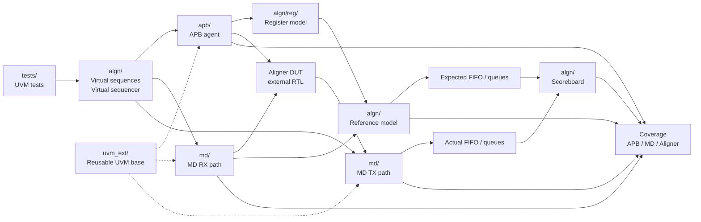
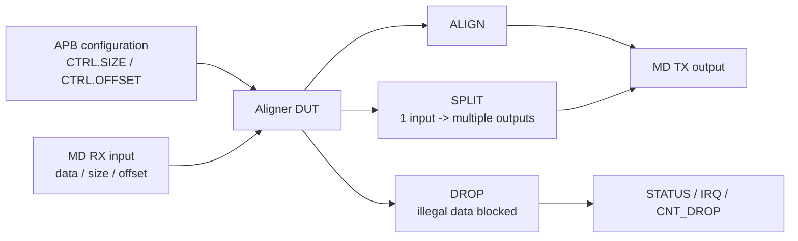
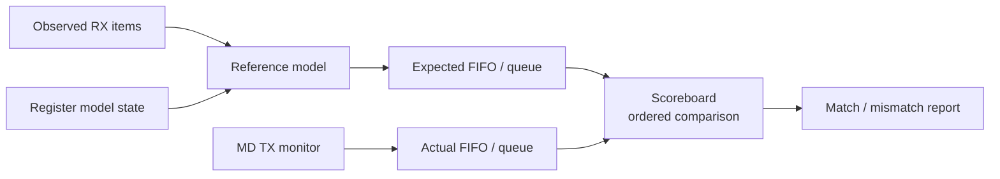

# Architecture — UVM Aligner Verification Environment

This document describes the architecture of the UVM verification environment for an **APB-controlled Aligner DUT**.

The DUT receives MD RX traffic, is configured through APB registers, processes the data, and produces MD TX output.

The main verification challenge is that the DUT output is **not always one-to-one** with the input.

The DUT may:

```text
Pass data
Align data
Split one input into multiple outputs
Drop illegal data
Update status / IRQ / drop information
Clear state during reset
```

Because of that, the environment uses a reference model and FIFO/queue-based scoreboard comparison instead of direct RX-to-TX comparison.

---

## 1. Architecture Overview



---

## 2. Main Verification Flow

```text
Test
→ Virtual Sequence / Virtual Sequencer
→ APB register configuration + MD RX stimulus
→ Aligner DUT
→ MD TX monitor captures actual output
→ Reference model predicts expected behavior
→ Expected FIFO + Actual FIFO
→ Scoreboard comparison
→ Functional coverage
```

The test does not manually drive every signal.  
It starts a virtual sequence, which coordinates APB configuration, MD RX traffic, and TX-side behavior/observation.

---

## 3. Repository-to-Architecture Mapping

```text
tests/
  UVM tests and test package.

algn/
  Aligner-specific environment:
  reference model, scoreboard, coverage,
  register predictor, virtual sequencer, and virtual sequences.

algn/reg/
  UVM register model:
  CTRL, STATUS, IRQEN, IRQ, and register block.

apb/
  APB verification agent:
  items, driver, monitor, coverage, sequences,
  agent configuration, package, and register adapter.

md/
  MD protocol verification agent:
  RX/TX items, drivers, monitors, coverage,
  sequencers, sequences, agent configurations, and package.

uvm_ext/
  Reusable UVM base infrastructure and coverage helpers.

tb/
  Testbench top and simulation file list.

docs/
  Documentation and demo logs.
```

---

## 4. APB Configuration Path

APB is the **configuration/control path**.

It is used to access DUT registers such as:

- `CTRL`
- `STATUS`
- `IRQEN`
- `IRQ`

APB is not payload data.

Example:

```text
APB writes CTRL.SIZE / CTRL.OFFSET
→ MD RX traffic enters
→ DUT aligns / splits / drops according to configuration
```

The APB monitor observes bus-level transactions.  
The register adapter connects APB transactions to the UVM register model.

---

## 5. MD RX/TX Data Path

MD is the data path.

### MD RX

MD RX injects input traffic into the DUT.

RX transactions may include:

- Data
- Offset
- Size
- Response expectation
- Delay/timing behavior
- Legal or illegal behavior

The RX monitor observes what actually entered the DUT, so the model is based on observed behavior and not only on what the sequence intended to send.

### MD TX

MD TX observes the DUT output.

The TX monitor does not generate expected data.  
It captures actual DUT behavior and sends it to the scoreboard.

```text
RX monitor      = what actually entered the DUT
TX monitor      = what actually exited the DUT
Reference model = what should have happened
Scoreboard      = expected vs actual comparison
```

---

## 6. Observable DUT Behavior Under Verification


The environment checks:

- Legal traffic
- Alignment
- Split behavior
- Drop/error behavior
- Status/IRQ behavior
- Reset behavior

---

## 7. Reference Model

The reference model predicts what the DUT should do.

It uses:

- Observed RX items
- Current APB register configuration
- Alignment logic
- Split logic
- Drop/error expectations
- Expected RX response
- Expected TX output
- Expected IRQ/status behavior
- CNT_DROP/drop-status prediction
- Reset handling

The model answers:

```text
Given what actually entered the DUT
and given the current APB configuration,
what should the DUT output or report?
```

---

## 8. Scoreboard

The scoreboard compares expected behavior against actual behavior.

It does **not** compare RX input directly to TX output.

That would be wrong because the DUT may create non-1:1 behavior:

```text
1 RX input         → 1 TX output
1 RX input         → multiple TX outputs
multiple RX inputs → 1 TX output
illegal RX input   → no TX output
reset              → state is cleared
```



This supports:

- Split transactions
- Delayed output
- Dropped traffic
- RX response checking
- IRQ/status checking
- Reset cleanup
- Ordered stream comparison

---

## 9. Reset and Error Handling

Reset is part of the verification architecture.

During reset, the environment clears or synchronizes model state, FIFOs/queues, internal buffers, and active checking processes to avoid stale comparisons.

Illegal traffic is also intentionally generated as negative testing:

```text
Illegal RX item
→ Model predicts error/drop behavior
→ Invalid data must not leak to TX
→ CNT_DROP/status behavior is checked
→ Scoreboard compares expected vs actual
→ Coverage samples the scenario
```

---

## 10. Coverage

Coverage measures which scenarios were exercised.

```text
Scoreboard: Was the behavior correct?
Coverage:   Which scenarios were tested?
```

Coverage includes:

- APB access/response/delay/reset behavior
- MD data/size/offset/response behavior
- Aligner split/drop behavior
- Status/IRQ/reset behavior
- Cross coverage between register configuration and MD traffic values

The project should not claim 100% coverage unless a real coverage report proves it.

---

## Short Summary

```text
APB controls the DUT.
MD RX sends data.
The Aligner DUT transforms the data.
MD TX monitor captures actual output.
The reference model predicts expected behavior.
The scoreboard compares expected vs actual using ordered queues.
Coverage measures APB, MD, split, drop, reset, status, and IRQ scenarios.
```
